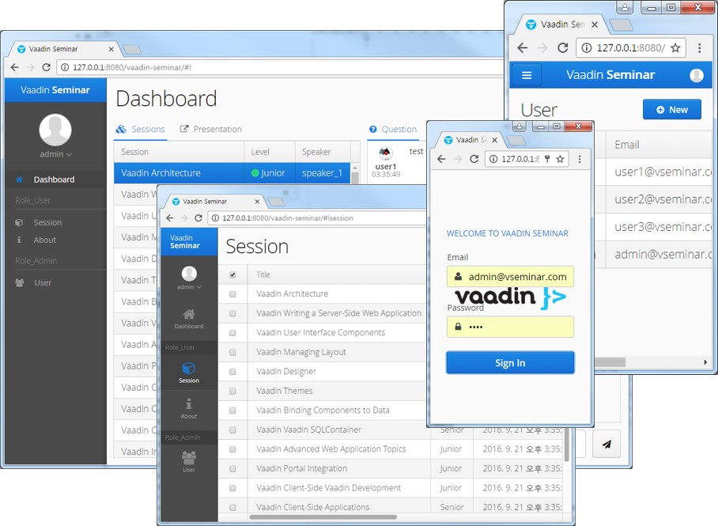
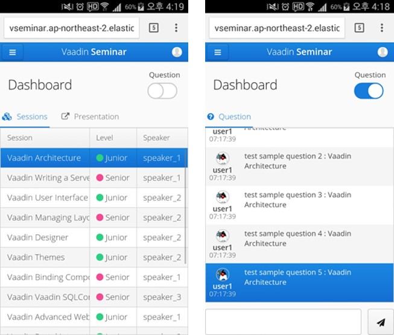
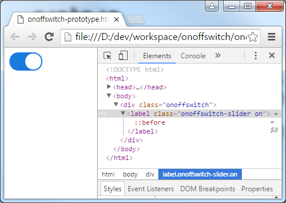

:book-link: http://www.basakpie.com

=  Jinson Book of Vaadin Examples

== Overview

{book-link}[Jinson Vaadin Book] example project

== Building from source

requires Java SE 1.7.0_79+

requires Maven 3.3.9+

requires Tomcat 8.0.36+

requires Eclipse Mars.2 4.5.2+ (Eclipse IDE for Java EE Developers 설치)

requires Vaadin Framework 7.6.5+

=== Vaddin Seminar Web(Mobile+Responsive Web)

==== Project Build & Start

* Change Directory

[source,groovy,indent=0]
----
cd vaadin-seminar
----

* Maven Build

[source,groovy,indent=0]
----
mvn -DskipITs clean install
----

* Maven WAS Start

[source,groovy,indent=0]
----
mvn jetty:run
----

http://127.0.0.1:8080/vaadin-seminar

id: admin@vseminar.com / user1@vseminar.com

password : 1234

=== Vaddin OnOffSwitch Add-ons

==== Project Build & Start

* Change Directory

[source,groovy,indent=0]
----
cd vaadin-onoffswitch
----

* Maven Build

[source,groovy,indent=0]
----
mvn clean install
----

* Maven WAS Start

[source,groovy,indent=0]
----
mvn -pl onoffswitch-demo jetty:run-war
mvn -pl onoffswitch-demo vaadin:run-codeserver
----

Code Server : http://127.0.0.1:9876

Demo Server : http://127.0.0.1:8080?superdevmode

* Maven Only WAS Start

[source,groovy,indent=0]
----
mvn -pl onoffswitch-demo jetty:run
----

Demo Server : http://127.0.0.1:8080

